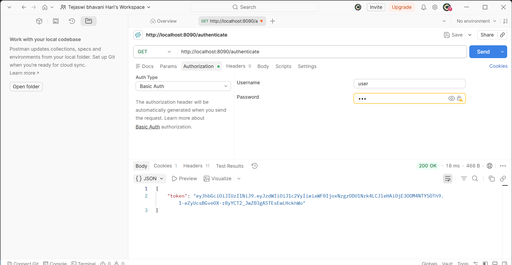

# Create authentication service that returns JWT

## Project Overview
This project demonstrates how to create a basic authentication service using Spring Boot and JSON Web Tokens (JWT). As the first step in the JWT process, it provides an `/authenticate` endpoint that accepts user credentials via Basic Authentication and returns a signed JWT token.

### Key Components
- **`pom.xml`**: Configured with `spring-boot-starter-security`, `jjwt` (version 0.9.1), and `jaxb-api` for JWT generation.
- **`SecurityConfig.java`**: A Spring Security configuration that permits unauthenticated access to the `/authenticate` endpoint while securing all other requests. 
- **`AuthenticationController.java`**: A REST controller that reads the `Authorization` header, decodes the base64-encoded `username:password`, and generates a JWT using `Jwts.builder()`.
- **`application.properties`**: Server runs on port **8090**.

## How to Run
Open a terminal in the project directory and start the application using the Maven wrapper:
```powershell
.\mvnw.cmd spring-boot:run
```

## Testing the Endpoint
Once the server is running on port 8090, you can request a token by supplying credentials in the `Authorization` header (Basic Auth).

For example, using cURL:
```bash
curl -s -u user:pwd http://localhost:8090/authenticate
```

### Postman Output
Below is the output when testing this endpoint using Postman, showing the generated JWT token in the JSON response:


