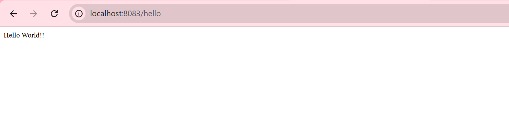
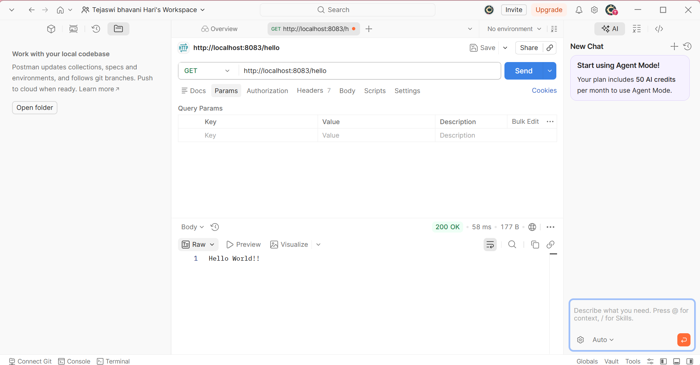

# Exercise: Hello World RESTful Web Service

## Objective
To write a basic REST service using the Spring Web Framework that returns the text "Hello World!!" when accessed via a GET request.

## Key Components
- **`HelloController.java`**: A REST controller class annotated with `@RestController`. It defines a `@GetMapping("/hello")` method named `sayHello()` which returns the hardcoded string "Hello World!!". It also includes SLF4J logging at the start and end of the method execution.
- **`application.properties`**: Configuration file updated to run the server on port `8083` to avoid port conflicts.

## HTTP Headers Output
Below are the screenshots capturing the HTTP headers received from the REST service during the SME walkthrough:

### Chrome Developer Tools (Network Tab)


### Postman (Headers Tab)


## How to Test
1. Open a terminal and navigate to this directory.
2. Run the application using the Maven wrapper:
   ```bash
   ./mvnw spring-boot:run
   ```
3. Access the endpoint at `http://localhost:8083/hello`.
