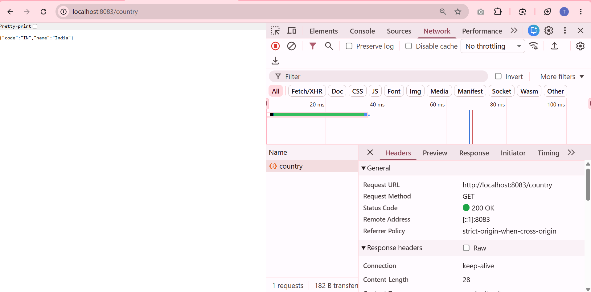
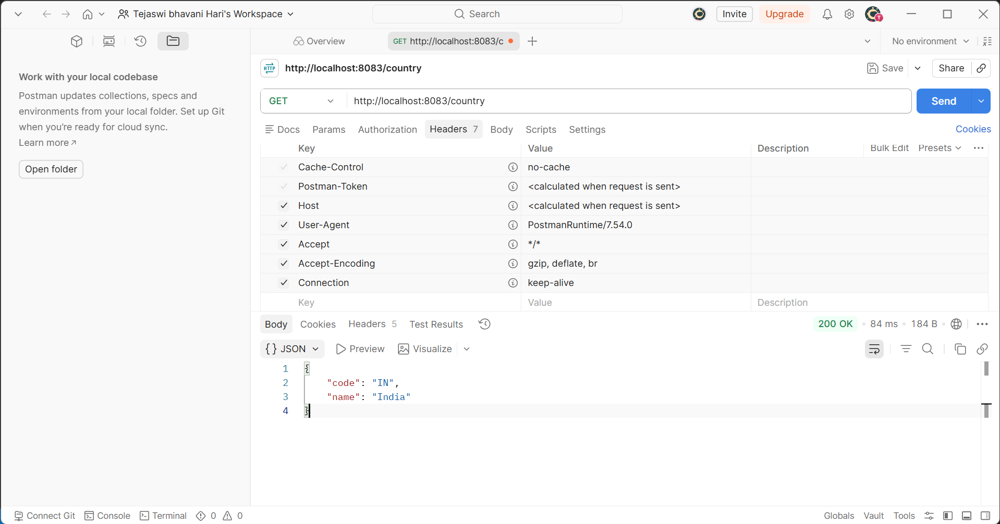

# REST Country Web Service

## Project Overview
This project is a standalone Spring Boot application that exposes a RESTful web service endpoint `/country`. It serves as an example of configuring Spring Beans via XML and fetching them within a Spring MVC REST controller.

### Project Structure
- **`src/main/java/.../model/Country.java`**: The data model representing a Country (code and name).
- **`src/main/resources/country.xml`**: The Spring configuration XML file where the India `Country` bean is defined.
- **`src/main/java/.../controller/CountryController.java`**: The REST controller handling the `/country` endpoint. It loads the `country.xml` application context and returns the defined Country bean.
- **`pom.xml`**: The Maven configuration file for managing dependencies (such as `spring-boot-starter-webmvc`).

### How to Run the Application
You can run this application using your IDE or via the command line:

**Using your IDE (Recommended):**
1. Open the project folder in your IDE.
2. Locate and run the main application class: 
   `src/main/java/com/cognizant/spring_learn/SpringLearnApplication.java`

**Using the Command Line:**
Open a terminal (e.g., PowerShell or Command Prompt) in the `REST Country Web Service` folder and execute the Maven wrapper:
```powershell
.\mvnw.cmd spring-boot:run
```
*(On Mac/Linux, use `./mvnw spring-boot:run`)*

Once the application starts, it will by default launch the embedded Tomcat server on port 8080. You can then test the endpoint by navigating to `http://localhost:8080/country` in your web browser or Postman.

---

## 1. What happens in the controller method?
When a GET request is made to the `/country` endpoint, the `getCountryIndia()` method in the `CountryController` is invoked. Inside this method:
1. An `ApplicationContext` is created by reading the `country.xml` Spring configuration file from the classpath.
2. The `Country` bean with id `in` is loaded from this context.
3. The method returns this `Country` object.

## 2. How the bean is converted into JSON response?
Because the `CountryController` is annotated with `@RestController` (or `@ResponseBody` on the method), Spring Boot automatically uses a registered `HttpMessageConverter` (specifically the `MappingJackson2HttpMessageConverter` provided by Jackson, which is included in the Spring Boot Web Starter) to serialize the returned `Country` Java object into a JSON response. 

## 3. In network tab of developer tools show the HTTP header details received
When you open a browser (like Chrome), go to `http://localhost:8083/country`, and inspect the Network tab:
- **Response Headers:**
  - `Content-Type`: `application/json` (indicating the response body is JSON)
  - `Transfer-Encoding`: `chunked`
  - `Date`: (Timestamp of the response)
  - `Keep-Alive`: `timeout=60`
  - `Connection`: `keep-alive`
  


## 4. In postman click on "Headers" tab to view the HTTP header details received
When you make a GET request to `http://localhost:8083/country` using Postman, the Headers tab in the response section will display similar headers:
- `Content-Type`: `application/json`
- `Transfer-Encoding`: `chunked`
- `Date`: (Timestamp of the response)
- `Keep-Alive`: `timeout=60`
- `Connection`: `keep-alive`



*(Note: The exact headers may vary slightly depending on your embedded server configuration, but `Content-Type: application/json` is the key header indicating successful JSON conversion.)*
