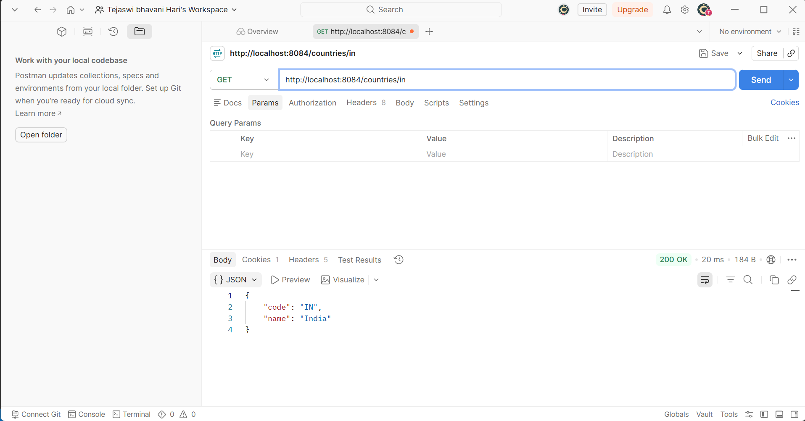

# REST Get country based on country code

## Project Overview
This project is an extension of the Spring Boot application that exposes a RESTful web service endpoint `/countries/{code}`. It retrieves a specific country from the XML configuration based on the provided country code (case-insensitive) using a Service layer.

### Project Structure
- **`src/main/resources/country.xml`**: The Spring configuration XML file defining a list of multiple `Country` beans (e.g., IN, US, DE, JP) stored in a `java.util.ArrayList`.
- **`src/main/java/.../service/CountryService.java`**: The service layer that loads the `countryList` from the Spring context and uses a Java Stream to find the matching country by its code.
- **`src/main/java/.../controller/CountryController.java`**: The REST controller handling the `/countries/{code}` endpoint using `@GetMapping` and `@PathVariable`.
- **`src/main/resources/application.properties`**: Configuration file setting the server port to **8084**.

### How to Run the Application
You can run this application using your IDE or via the command line:

**Using your IDE (Recommended):**
1. Open the project folder in your IDE.
2. Locate and run the main application class: 
   `src/main/java/com/cognizant/spring_learn/SpringLearnApplication.java`

**Using the Command Line:**
Open a terminal (e.g., PowerShell or Command Prompt) in the `REST Get country based on country code` folder and execute the Maven wrapper:
```powershell
.\mvnw.cmd spring-boot:run
```
*(On Mac/Linux, use `./mvnw spring-boot:run`)*

Once the application starts, it will launch the embedded Tomcat server on port **8084**.

---

## Testing the Endpoints

### 1. Requesting India (IN)
Navigate to `http://localhost:8084/countries/in` (or `/IN`). The application performs a case-insensitive search using Java Streams and returns the JSON response for India.



### 2. Requesting Japan (JP)
Navigate to `http://localhost:8084/countries/jp` (or `/JP`). The application finds the newly added bean and returns the JSON response for Japan.


