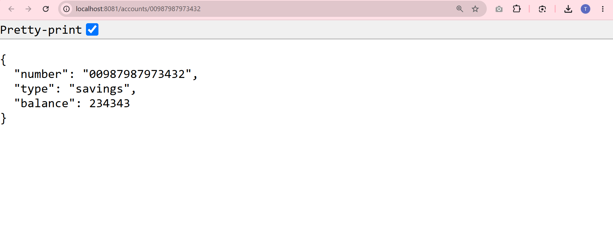
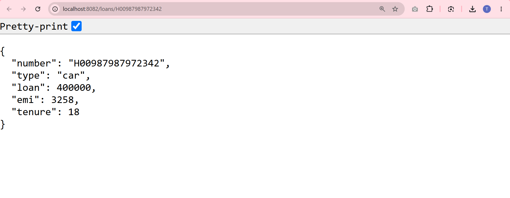

# Creating Microservices for Account and Loan

This project demonstrates the creation of two independent Spring Boot RESTful Web Service microservices for a banking domain: one for handling accounts and another for handling loans.

## 1. Account Microservice

The **Account** microservice is a standalone application that provides a REST endpoint to fetch account details based on an account number.

- **Port:** `8081`
- **Method:** `GET`
- **Endpoint:** `/accounts/{number}`

### Output


---

## 2. Loan Microservice

The **Loan** microservice is another standalone application that provides a REST endpoint to fetch loan details based on a loan account number. 

- **Port:** `8082` (Configured to avoid port conflict with the account service)
- **Method:** `GET`
- **Endpoint:** `/loans/{number}`

### Output


---

## How to Run
1. Navigate to the `account` directory and run:
   ```bash
   mvn spring-boot:run
   ```
2. Navigate to the `loan` directory and run:
   ```bash
   mvn spring-boot:run
   ```
3. Test the endpoints in your browser or Postman using the respective ports (`8081` and `8082`).
