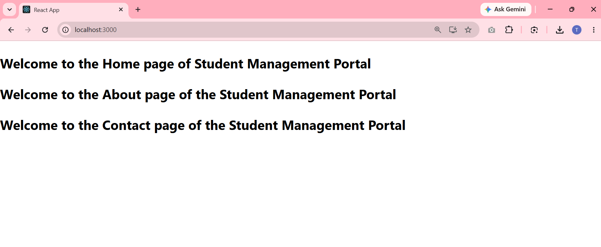

# Student Management Portal

This project was bootstrapped with [Create React App](https://github.com/facebook/create-react-app).

## Overview

This is a React application named **studentapp** that displays a student management portal. It demonstrates the use of multiple components by rendering three custom components on the main page:
- `Home` component
- `About` component
- `Contact` component

### Output

## Available Scripts

In the project directory, you can run:

### `npm start`

Runs the app in the development mode.\
Open [http://localhost:3000](http://localhost:3000) to view it in your browser.

The page will reload when you make changes.\
You may also see any lint errors in the console.
