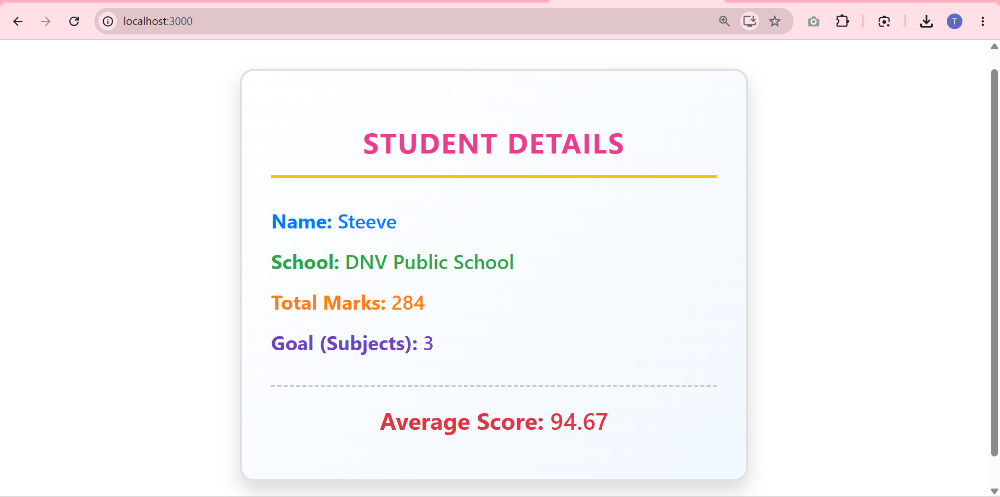

# Score Calculator App

This project was bootstrapped with [Create React App](https://github.com/facebook/create-react-app).

## Overview

This is a React application named **scorecalculatorapp** designed for a Student Management Portal. It demonstrates the use of a React **Functional Component** and applying custom CSS styling.

The application features a single `CalculateScore` component that accepts the following props:
- `Name`: The name of the student.
- `School`: The name of the school.
- `Total`: The total marks obtained by the student.
- `Goal`: The total number of subjects or maximum marks goal.

The component computes the **Average Score** by dividing `Total` by `Goal`. It also uses custom colorful CSS (`mystyle.css`) to visually distinguish each data point on the screen.

### Output

## Available Scripts

In the project directory, you can run:

### `npm start`

Runs the app in the development mode.\
Open [http://localhost:3000](http://localhost:3000) to view it in your browser.

The page will reload when you make changes.\
You may also see any lint errors in the console.
