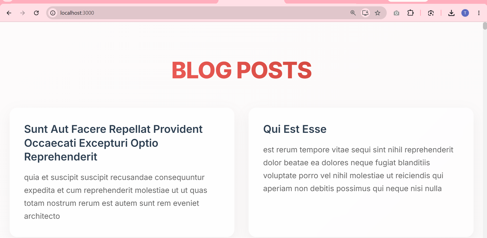

# Blog App

This project was bootstrapped with [Create React App](https://github.com/facebook/create-react-app).

## Overview

This is a React application named **blogapp** that demonstrates the use of React Component Lifecycle Hooks and the Fetch API. 

The application utilizes class-based components to achieve the following:
- **`Posts` Component**: A stateful component that manages a list of blog posts.
- **`loadPosts()` Method**: Uses the native JavaScript `fetch()` API to asynchronously retrieve a list of dummy blog posts from `https://jsonplaceholder.typicode.com/posts`.
- **`componentDidMount()` Lifecycle Hook**: Ensures that `loadPosts()` is called precisely when the component is first mounted to the DOM.
- **`componentDidCatch()` Lifecycle Hook**: Acts as an error boundary to intercept and display alert messages if any of the child components throw an exception.
- **`Post` Component**: A child component that receives a `title` and `body` as props and elegantly renders a single blog post.

### Output

The UI features a modern, premium design utilizing glassmorphism, beautiful gradients, and hover micro-animations.

## Available Scripts

In the project directory, you can run:

### `npm start`

Runs the app in the development mode.\
Open [http://localhost:3000](http://localhost:3000) to view it in your browser.

The page will reload when you make changes.\
You may also see any lint errors in the console.
