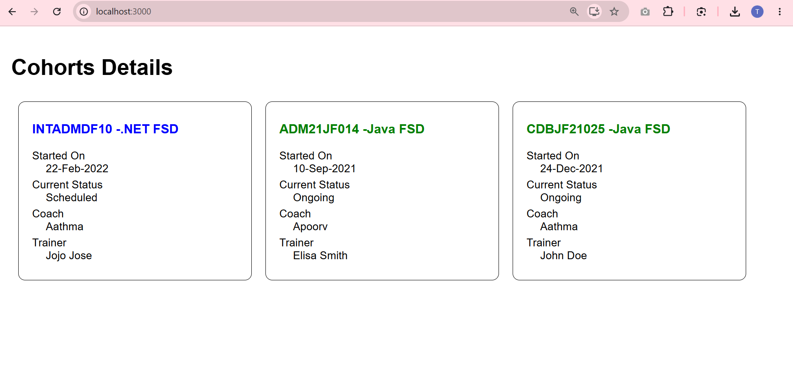

# Cohort Details App

This project was bootstrapped with [Create React App](https://github.com/facebook/create-react-app).

## Overview

This is a React application named **cohortapp** designed for the My Academy team at Cognizant. It displays the details of ongoing and scheduled cohorts using React components and CSS Modules.

The application highlights:
- **`CohortDetails` Component**: A reusable React component that accepts props (`title`, `startDate`, `status`, `coach`, `trainer`) to render a cohort card.
- **Dynamic Inline Styling**: The component intelligently renders the title in **green** if the cohort is "Ongoing", and **blue** otherwise.
- **CSS Modules**: Uses `CohortDetails.module.css` to scope styling directly to the component.
- **Clean Structure**: The UI utilizes description lists (`<dl>`, `<dt>`, `<dd>`) perfectly mapped to CSS styles.

### Output

## Available Scripts

In the project directory, you can run:

### `npm start`

Runs the app in the development mode.\
Open [http://localhost:3000](http://localhost:3000) to view it in your browser.

The page will reload when you make changes.\
You may also see any lint errors in the console.
