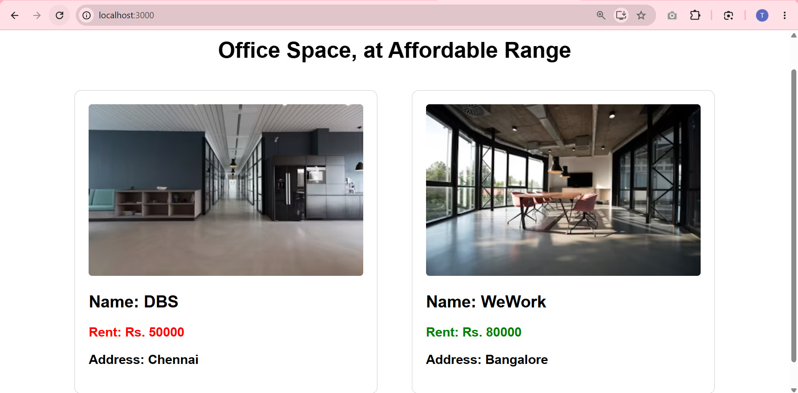

# Office Space Rental App

This project was bootstrapped with [Create React App](https://github.com/facebook/create-react-app).

## Overview

This is a React application named **officespacerentalapp** that demonstrates fundamental JSX capabilities and React node creation.

The application highlights:
- **JSX Elements & DOM Rendering**: Utilizes standard JSX (`<h1>`, `<h2>`, `<h3>`, ``) to effortlessly create and render elements to the DOM.
- **JavaScript Expressions**: Iterates over a JavaScript array of `offices` containing Name, Rent, and Address using the `.map()` function embedded directly within the JSX structure.
- **Attributes in JSX**: Passes image URLs via the `src` attribute and maps `alt` text to the `` tag.
- **Inline Styling**: Leverages JSX `style={{...}}` properties to dynamically inject CSS styles into components.
- **Conditional Formatting**: Specifically applies dynamic inline CSS logic (`office.rent <= 60000 ? 'red' : 'green'`) to color the Rent text based on the numeric value.

### Output

## Available Scripts

In the project directory, you can run:

### `npm start`

Runs the app in the development mode.\
Open [http://localhost:3000](http://localhost:3000) to view it in your browser.

The page will reload when you make changes.\
You may also see any lint errors in the console.
