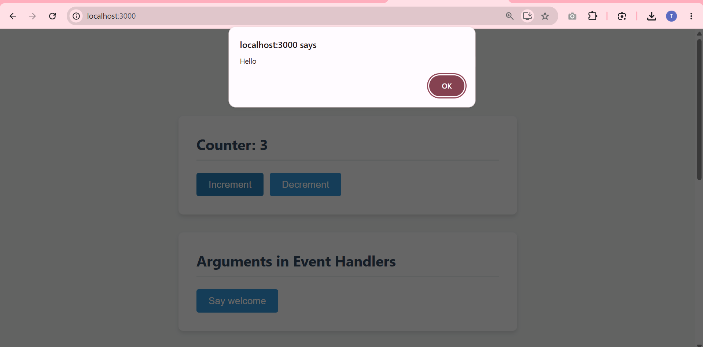
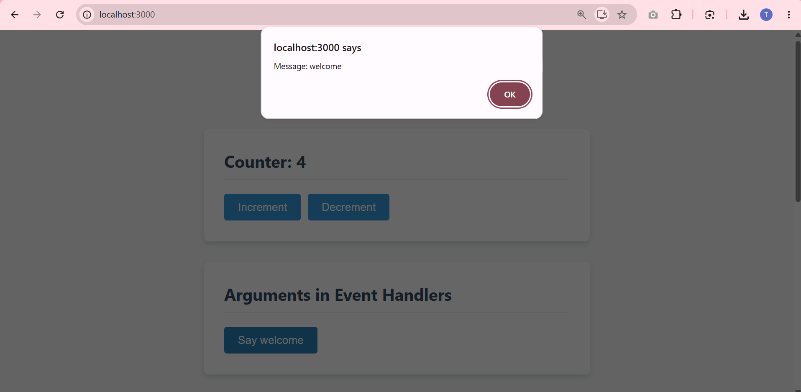
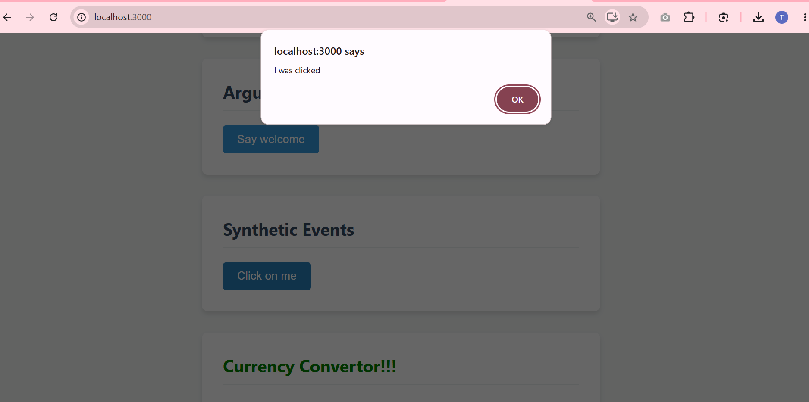
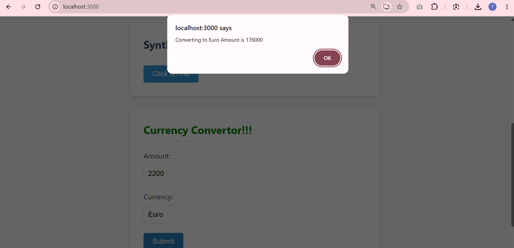

# Event Examples App

This project was bootstrapped with [Create React App](https://github.com/facebook/create-react-app).

## Overview

This is a React application named **eventexamplesapp** that demonstrates how to handle various forms of events in React, utilizing synthetic events and standard event handlers.

The application satisfies the following core objectives and features:

### 1. Multiple Method Invocation
The "Increment" button is designed to increase the value of a counter, while simultaneously triggering a secondary method to say Hello followed by a static message.

### 2. Arguments in Event Handlers
The "Say Welcome" button dynamically invokes an arrow function that accepts a parameter, specifically passing the string "welcome" as an argument to be displayed in an alert.

### 3. Synthetic Events
A dedicated button invokes a React Synthetic Event (`onPress`), extracting data directly from the event object (`e.type`) to display an "I was clicked" alert message.

### 4. Currency Convertor Component
A `CurrencyConvertor` component handles form submission (`handleSubmit`) via a Convert button click. It intercepts the event, prevents default page reloading, and processes the mathematical conversion of Indian Rupees and Euros.

## Available Scripts

In the project directory, you can run:

### `npm start`

Runs the app in the development mode.\
Open [http://localhost:3000](http://localhost:3000) to view it in your browser.

The page will reload when you make changes.\
You may also see any lint errors in the console.
