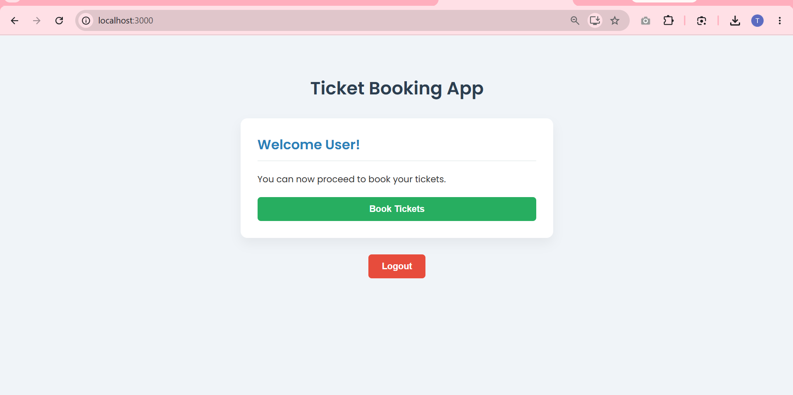
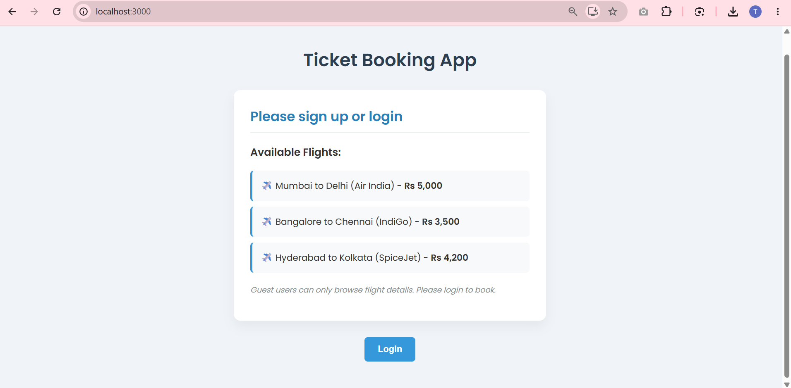

# Ticket Booking App

This project was bootstrapped with [Create React App](https://github.com/facebook/create-react-app).

## Overview

This is a React application named **ticketbookingapp** that demonstrates the concept of **Conditional Rendering** and **Element Variables**.

The application dynamically toggles between two different views based on the user's authentication state (`isLoggedIn`):

### Guest View (Logged Out)
When the user is logged out, the application displays a list of available flights for browsing. The user is prompted to sign up or login.

### User View (Logged In)
When the user successfully clicks the Login button, the state changes to logged in. The component dynamically re-renders to display a personalized greeting and a "Book Tickets" button, hiding the generic flight browse list.

## Concepts Demonstrated
- **Conditional Components:** Created a wrapper `<Greeting isLoggedIn={isLoggedIn} />` component that checks the boolean property to return either the `<UserGreeting />` or `<GuestGreeting />` component.
- **Element Variables:** Utilized a JavaScript variable `let button;` inside the render function to programmatically assign either a Login or Logout `<button>` depending on the state, and then rendered it inside the JSX output.

## Available Scripts

In the project directory, you can run:

### `npm start`

Runs the app in the development mode.\
Open [http://localhost:3000](http://localhost:3000) to view it in your browser.

The page will reload when you make changes.\
You may also see any lint errors in the console.
