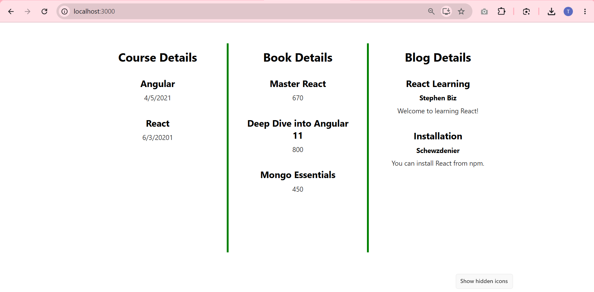

# Blogger App

This project was bootstrapped with [Create React App](https://github.com/facebook/create-react-app).

## Overview

This is a React application named **bloggerapp** that focuses heavily on teaching **Conditional Rendering** techniques and rendering lists using **React Keys** and the **`map()`** function.

### Core Implementation Details
The UI is divided into three parallel components (Course Details, Book Details, and Blog Details), each demonstrating a different method of rendering array data conditionally:

1. **Course Details (`&&` Operator)**
   Extracts course arrays and renders them using the logical `&&` operator inline. The list only renders if the array actually contains objects.
2. **Book Details (Ternary `? :`)**
   Checks for data using a ternary operator directly inside the JSX payload. If data exists, it maps over the books; otherwise, it returns fallback HTML text seamlessly.
3. **Blog Details (`if/else` Statement)**
   Uses a standard JavaScript `if` statement to intercept empty arrays *before* the component hits its `return` block, returning a completely different JSX structure (early return) if no blogs are present.

### List Rendering & Keys
Each array is iterated over using `Array.prototype.map()`. To optimize DOM mutation performance, every iterated child component extracts a unique identifier (`item.id`) and assigns it to the React `key={...}` attribute.

### Application Output

## Available Scripts

In the project directory, you can run:

### `npm start`

Runs the app in the development mode.\
Open [http://localhost:3000](http://localhost:3000) to view it in your browser.

The page will reload when you make changes.\
You may also see any lint errors in the console.
