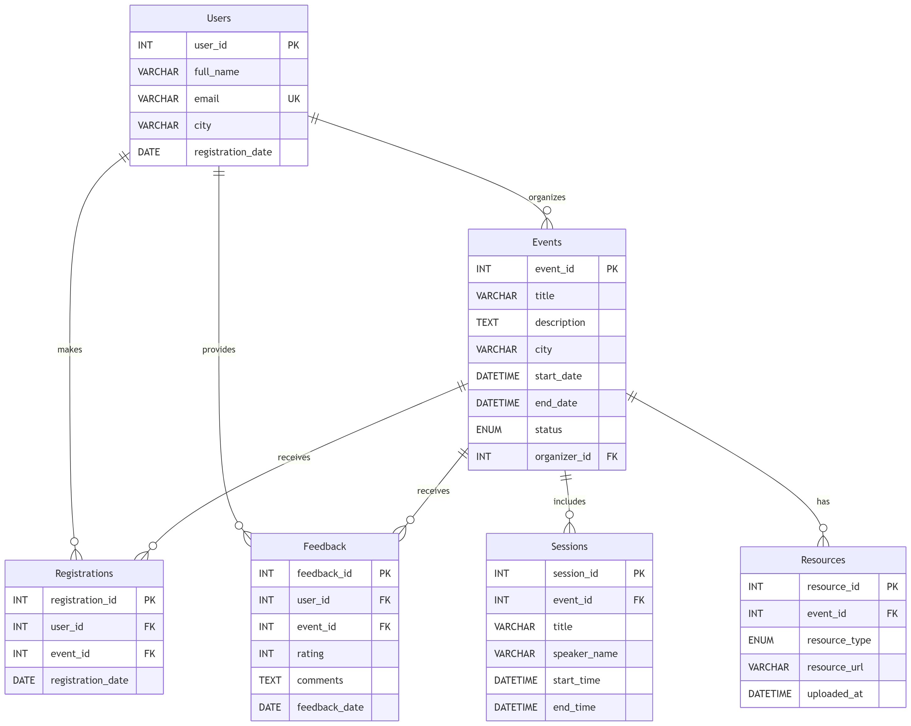

# ANSI SQL Using MySQL Exercises

This folder contains the database schema, sample data, and exercise solutions for the ANSI SQL assignment.

## Structure
- `database/create_tables.sql`: Schema definitions.
- `database/insert_data.sql`: Sample dataset populator.
- `database/schema_diagram.png`: Database ER Schema diagram.
- `exercises/`: Solutions for queries 1 through 25 saved progressively as `exercise(n).sql`.

## Schema Diagram

## How to use
1. Run `create_tables.sql` against your MySQL instance.
2. Run `insert_data.sql` to populate constraints.
3. Review or execute individual queries inside the `exercises/` directory to see the corresponding results.
